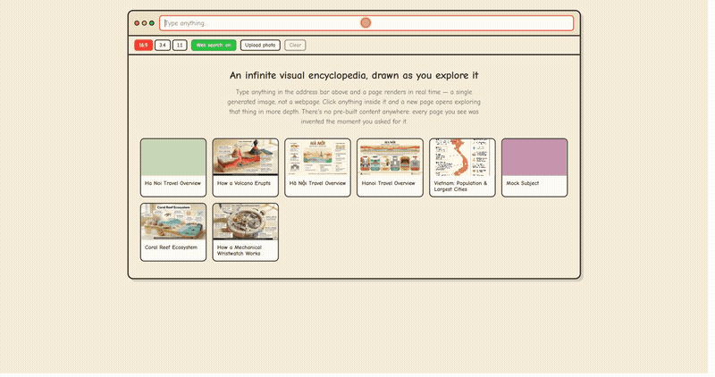

# flipbook

An infinite "browser" where every page is a single AI-generated image instead of HTML. Type
anything and a page renders in real time; click anything inside that image and a new image
generates exploring that thing in more depth. No markup, no links — just pixels, generated on
demand as you go.



This is an **independent, open-source homage** to [flipbook.page](https://flipbook.page) — it
is not affiliated with, endorsed by, or built by the flipbook.page team. It exists because the
idea (a whole browsing experience made of nothing but generated images) was interesting enough
to want to understand and rebuild from scratch.

## Features

- **Infinite tap-to-explore navigation** — click anything inside the current page and a new page
  generates around whatever you tapped, with no predefined map or link graph behind it.
- **Search and edit, not just tap** — type a query to start anywhere, or type a command over an
  open page ("make it night time") to regenerate it in place.
- **Breadcrumb address bar** — every page you visit is a real stop in a trail; step back, forward,
  or straight to any ancestor.
- **Page-transition morphs** — an optional generated clip plays the parent page melting into the
  child as you tap, reversible on the way back, with a crossfade fallback for longer jumps.
- **Idle-loop video** — an optional short looping clip (water, steam, light) cross-fades in over a
  finished page's static image.
- **Tap caching** — repeat clicks near the same spot, or on a subject already explored under the
  same parent, reuse work instead of regenerating from scratch.
- **Photo upload** — start exploring from your own image instead of a generated one (optional).
- **Web search grounding** — page content can be grounded in a real search instead of the model's
  own knowledge (optional).
- **Style and composition pickers** — swap the whole app's visual identity (felt, papercut, riso,
  pixel, editorial) or its projection (flat, isometric, diorama) live, per page.

## Supported providers

| Role | Providers |
|---|---|
| Prompt authoring + tap vision (LLM) | Anthropic (or any Anthropic-compatible proxy) · Google Gemini |
| Image generation | fal.ai · BytePlus Ark (Seedream) · Google Gemini ("nano banana") · OpenAI (gpt-image) |
| Idle-loop video + page-transition morphs | BytePlus Ark (Seedance) |
| Web search grounding | Anthropic-compatible provider's server-side web-search tool |

See **Configuration** below for the env vars that select and tune each one.

## How it works

**The loop.** A query (or a click, or a typed edit command) becomes a request to a single SSE
endpoint, `POST /api/generate`, which streams back `start → [tap_subject] → preview → complete`
(or `error`). Three request modes share that one endpoint:

- `search` — the user typed a query.
- `tap` — the user clicked a point on the current page.
- `edit` — the user typed a command while a page is open ("make it night time").

**The tap trick.** There's no click-coordinate API. When you tap the image, the client draws the
*current page* onto a canvas with a marker painted at the exact click point — a red circle with a
white halo and crosshair ticks (`apps/web/src/lib/tapMarker.ts`) — exports it as a JPEG, and sends
that whole marked-up image to the server. A vision model looks at the picture and names whatever
is under the marker. That name streams back immediately as a `tap_subject` event (so the address
bar updates before the next image even starts generating), then feeds into authoring the child
page. This is the same trick the original site uses, discovered by reading its network traffic.

**Content and style are two separate prompts.** The LLM that authors each page
(`apps/server/src/prompts/page-author.md` / `edit-author.md`) writes *only* content: the title,
the layout, every exact string to render, which regions get callouts. It is explicitly forbidden
from describing style, palette, material, or lighting. A second, fixed file,
`apps/server/src/prompts/art-style.md`, owns the visual identity (a needle-felted-wool diorama
by default, four alternate styles available via `ART_STYLE`) and gets appended to every image
prompt server-side. The split means every page shares one consistent look regardless of topic,
and swapping the entire app's aesthetic is a one-file edit. A second, independent axis,
`COMPOSITION` (`flat` · `isometric` · `diorama`, default `diorama`), picks the projection the
scene is drawn in — the two combine freely, so "editorial style, isometric composition" and "felt
style, diorama composition" are both valid pages. It also encodes a governing rule
learned the hard way: every text-bearing region on the page must be filled with an exact string a
prompt supplied, never left for the image model to invent — an unspecified region is reliably
either garbled or (for a title's would-be subtitle) fabricated outright.

**Three cache layers**, all optional, applied on every tap:

1. **Coordinate-grid VLM cache** — clicks are quantized to a coarse grid per page; a nearby
   repeat click reuses the subject the vision model already named, skipping that call entirely.
2. **Subject-level child dedup** — once a subject is known, an existing child node under the same
   parent with the same (normalized) subject is reused outright: instant navigation, zero
   generation cost.
3. **Prompt-hash image cache** — if the authoring LLM happens to produce byte-identical prompt
   text (common for repeated searches), the previously-generated image is served instead of
   regenerating.

Set `TAP_DEDUP=variant` to keep the caches' VLM savings but always regenerate a fresh image, or
`TAP_DEDUP=off` to match the original site's always-fresh behavior exactly.

**Idle-loop video** (experimental, off by default). After a page completes, if `VIDEO_ENABLED=true`,
a short looping video is generated in the background from that page's image (steam drifting, water
rippling, that kind of thing) and cross-fades in over the static image once ready. See **Known
limitations** for the current rough edges.

**Page-transition morphs** (experimental, off by default). After a *child* page completes (a tap
or an edit — anything with a parent), if `MORPH_ENABLED=true` a clip is generated in the background
with the parent's image as the first frame and the child's image as the last, so the tapped subject
stays anchored on screen while the rest of the page repaints into the new one.

The transition waits for it. Once the new page's image is ready, the app stays on the page you're
leaving until that page's clips have finished rendering, then plays the morph straight into the new
page — so the morph appears on the *first* tap, not only on a later revisit. The wait is bounded by
a timeout and only ever happens while the per-session cap has room; past the cap, or with the
feature off, navigation is instant as before. A page that missed its chance (created while Live
video was off, or reopened from a cached-tap marker, which never runs the generate pipeline) can be
given both clips later with the **✨ Animate page** button.

Going *back* one step replays the same clip in reverse. A morph is a first-frame/last-frame
interpolation from the parent's image to the child's, so its reverse is exactly the parent-ward
transition — no second generation and no extra video quota, just a local `ffmpeg -vf reverse`
re-encode written alongside it (`MORPH_REVERSE`, on by default; without ffmpeg it simply doesn't
happen). Anything further than one step — a breadcrumb jump to a distant ancestor — spans several
parent/child pairs, so no single clip could represent it and those get a short crossfade instead.

Verified against the live Ark API before building the feature, frame by frame; the current model
doesn't hold the camera perfectly still despite an explicit fixed-camera instruction — it reads
more like a deliberate zoom into the tapped subject than drift, but it's a real deviation from
the prompt, not a stylistic choice.

## Setup

Requires Node 22.5+ — this project uses the built-in `node:sqlite` module, which is still marked
experimental at that version; the warning it prints on startup is expected and harmless.

```bash
npm install
cp .env.example .env          # secrets (API keys) go here
cp config.example.yml config.yml   # everything else (providers, models, flags) — optional
npm run dev:server   # http://localhost:8787
npm run dev:web      # http://localhost:5173 — proxies /api, /images, /n to the server above
```

Open http://localhost:5173, type a query, and click anywhere in the generated image.

**No API keys? It still runs.** Every provider — the prompt-authoring LLM, the tap vision model,
the image generator, web search, video — falls back to a deterministic mock when its key is
missing, so the whole loop works end to end with zero configuration. The server logs exactly
which keys are missing (and which capability fell back) on startup.

**Windows note:** if the Vite dev server misbehaves, `npm run build` once and hit the single Hono
server directly at http://localhost:8787 — `npm start` serves the built SPA and the API from the
same origin, no proxy involved.

### Configuration

Configuration is split by sensitivity, resolved with a fixed precedence:

> **environment variable  >  `config.yml`  >  built-in default**

- **`config.yml`** (non-secret, gitignored — copy from `config.example.yml`): provider selection,
  model names, feature flags, and tunables, in a nested structure that's easy to manage as the
  number of providers grows. Optional — omit it and everything falls back to env/defaults.
- **`.env`** (secrets, gitignored — copy from `.env.example`): API keys only, plus any env override
  you want to force. Env-first precedence means a deployment can override any single `config.yml`
  value without editing the file.

Nothing but a single LLM provider and a single image provider is ever required — everything else
has a safe fallback. The table below lists each setting as its **env-override name**; the matching
`config.yml` path is shown in `config.example.yml`.

| Env override | Purpose | Options |
|---|---|---|
| `LLM_PROVIDER` | Prompt authoring + tap vision model | `anthropic` (Anthropic Messages API — works with a real Anthropic key **or** any Anthropic-compatible proxy via `LLM_BASE_URL`) · `gemini` · `mock` (default when no key is set) |
| `LLM_API_KEY`, `LLM_BASE_URL` | Credentials/endpoint for the `anthropic` provider | `LLM_BASE_URL` has no `/v1` suffix — the SDK appends `/v1/messages` itself |
| `PROMPT_AUTHOR_MODEL`, `TAP_VLM_MODEL` | Which models to call through that provider | any model id your endpoint serves; the VLM model must accept image input |
| `GEMINI_API_KEY` | Credentials for the `gemini` provider | — |
| `IMAGE_PROVIDER` | Image generation | `fal` (fal.ai) · `ark` (BytePlus Ark / Seedream) · `gemini` (Google "nano banana") · `openai` (gpt-image) · `mock` (default when no key is set) |
| `ARK_API_KEY`, `ARK_BASE_URL` | Credentials/endpoint for `ark` | — |
| `ARK_IMAGE_MODEL`, `ARK_IMAGE_MODEL_FALLBACK` | Primary model + an automatic fallback used on quota errors | e.g. `seedream-4-5-251128` / `seedream-4-0-250828` |
| `FAL_KEY`, `IMAGE_MODEL` | Credentials/model for `fal` | — |
| `GEMINI_API_KEY`, `GEMINI_IMAGE_MODEL` | Credentials/model for `gemini` image | e.g. `gemini-3.1-flash-lite-image` · `gemini-3.1-flash-image` · `gemini-3-pro-image` |
| `OPENAI_API_KEY`, `OPENAI_IMAGE_MODEL`, `OPENAI_IMAGE_QUALITY` | Credentials/model/quality for `openai` image | e.g. `gpt-image-1.5` · quality `low`/`medium`/`high` |

Adding another image provider is a one-file change: create a module under `apps/server/src/providers/image/`
that exports an `ImageProviderFactory` (see `registry.ts`) and add it to the array in `image/index.ts` —
no `switch`/`if` to touch. Each factory owns its own key lookup and config, and `referenceImageDataUrl`
(tap/edit continuity) is optional per provider (`gemini` uses it; `openai` currently ignores it).
| `SEARCH_PROVIDER` | Optional web search grounding for page content | `llm` (uses the Anthropic-compatible provider's server-side web-search tool) · `none` |
| `SEARCH_MODEL` | Model used for search | — |
| `ART_STYLE` | Fixed visual style applied to every page | `felt` (default) · `papercut` · `riso` · `pixel` · `editorial` |
| `COMPOSITION` | Projection every page is drawn in, independent of `ART_STYLE` | `diorama` (default) · `flat` · `isometric` |
| `TAP_DEDUP` | Tap caching mode (see above) | `reuse` (default) · `variant` · `off` |
| `VIDEO_ENABLED` | Master switch for idle-loop video | `false` (default) |
| `VIDEO_PROVIDER` | Video generation | `ark` (BytePlus Seedance) · `mock` (default even if `ARK_API_KEY` is set — video is opt-in separately from images) |
| `ARK_VIDEO_MODEL`, `VIDEO_RESOLUTION`, `VIDEO_DURATION_SECONDS`, `VIDEO_MAX_PER_SESSION` | Video generation tuning + a hard per-session cap | — |
| `MORPH_ENABLED` | Master switch for page-transition morphs | `false` (default) |
| `MORPH_MAX_PER_SESSION` | Hard per-session cap on morph generations (reuses `VIDEO_PROVIDER`/`ARK_VIDEO_MODEL`/`VIDEO_RESOLUTION`/`VIDEO_DURATION_SECONDS` above) | — |
| `MORPH_REVERSE` | Re-encode each morph backwards (needs `ffmpeg` on PATH) so stepping back replays it in reverse. Costs no video quota. Off = back-navigation crossfades | `true` (default) |
| `PORT`, `DATABASE_URL`, `IMAGES_DIR` | Server port, SQLite file path, disk path for generated images | — |

## Cost

Real generation (not the mock providers) costs roughly one LLM call, one image generation, and —
for a tap — one extra vision-model call per page. With BytePlus Ark's Seedream 4.5, a single image
runs about **$0.03**. LLM cost depends entirely on which model you point `LLM_PROVIDER` at; the
defaults above assume a proxy/account you already have configured. There's no draft/final two-tier
render here — every page renders at one quality level, which keeps the
per-page cost to that single image call. Video and morphs, when enabled, cost meaningfully more per
page than an image and are each capped per session (`VIDEO_MAX_PER_SESSION`,
`MORPH_MAX_PER_SESSION`) for exactly that reason.

## Known limitations

- **Compound Vietnamese diacritics get mangled by Seedream.** Base modifier + tone mark combined
  ("Hà Nội" → "Hà Nỗi", "Hoàn Kiếm" → "Hoàn Kiêm") render wrong more often than not, even when the
  prompt explicitly spells the name without diacritics — the model tends to "auto-correct" it back
  to an accented (and often wrong) spelling. The current mitigation is aggressive: proper nouns
  from heavily diacritic-marked scripts are spelled in plain ASCII with an explicit anti-example
  telling the model which accented variants *not* to render. It measurably helps but isn't
  airtight. A model with genuinely reliable diacritic rendering would make this moot.
- **Dense pages (7-8 callouts) can still merge or drop a label**, independent of the numeral-badge
  fix above — two adjacent callouts' text occasionally blends into one garbled plaque, or a label
  goes missing while its leader line and drawn subject still render fine. Lower callout counts
  (4-6) are visibly more reliable.
- **Idle-loop video text instability.** Small, secondary text can visibly mutate frame-to-frame
  during video generation even with an explicit "don't redraw any text" instruction — the title
  card and footer caption hold up well, but anything smaller and lower-contrast is at risk. Since
  the house style forbids inventing secondary text regions at all now, this mostly shows up as a
  residual risk rather than a routine failure.
- **Page-transition morphs are pre-generated, not real-time.** The original streams a live video
  transition over a WebSocket to a self-hosted model as you tap; this project intentionally
  doesn't reproduce that architecture. Instead the clip is generated as a whole file after the
  tap/edit completes, and the transition waits for it — which is why stepping into a new page
  takes noticeably longer with morphs on than with them off, where the original stays interactive
  throughout. The model also doesn't hold the camera perfectly fixed despite the prompt asking for
  it (see **How it works**).
- **No true two-tier draft/final rendering.** Dropped by design — see **Cost**.

## Roadmap

Roughly, in priority order: a real waitroom/rate-limiting layer for public deployments, an S3/R2
storage driver, and continued work on the callout-density and diacritics limitations above as
image models improve.

## License

MIT — see `LICENSE`.
